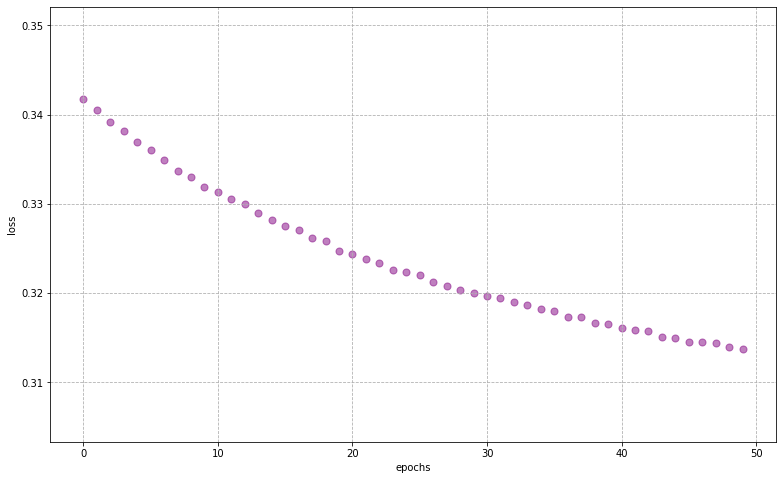
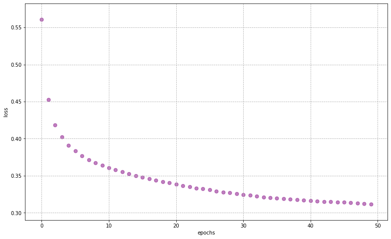
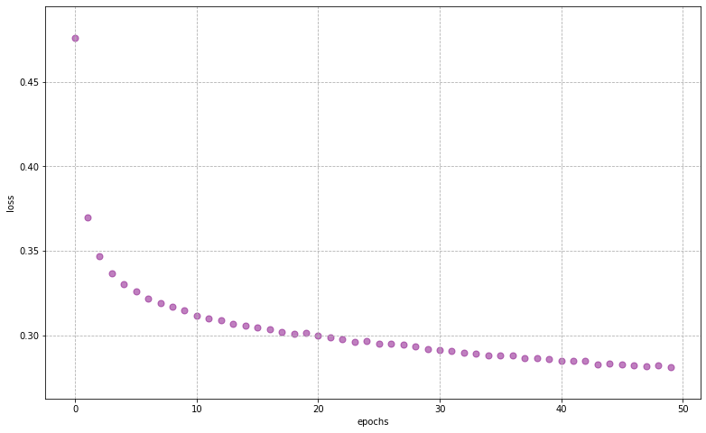

Most of this code can be found at <a href='https://keras.io'>keras.io</a>

## Questions
- No questions right now...


## Objectives 
YWBAT 
- build a neural network using keras
- compare models based on their depth
- *choose the best optimizer for a model*

### Why do we use NNs?
- identify combinations of features and learn combinations of features
- reduces the need for domain expertise
    - unstructured data is handled better
    - ambiguous data

### Outline
* Import data
* Build single layer model
* Build 2 layer model
* Students build their own deep learning model
* evaluate models, tune optimizers

# Useful Imports


```python
import keras
import numpy as np
import pandas as pd

from sklearn.metrics import classification_report

import matplotlib.pyplot as plt
```

    Using TensorFlow backend.


```python
from keras import models
from keras import layers
from keras import optimizers
```

# Obtaining Dataset & Train-Test Split

Nothing different from training other models


```python
from sklearn.datasets import load_iris
from sklearn.model_selection import train_test_split
from sklearn.preprocessing import OneHotEncoder, StandardScaler

iris = load_iris()
x = iris['data']
y = iris['target']
names = iris['target_names']
feature_names = iris['feature_names']

# One hot encoding
enc = OneHotEncoder()
y = enc.fit_transform(y[:, np.newaxis]).toarray()

# Scale data to have mean 0 and variance 1 
# which is importance for convergence of the neural network
scaler = StandardScaler()
x_scaled = scaler.fit_transform(x)

# Split the data set into training and testing
x_train, x_test, y_train, y_test = train_test_split(x_scaled, y, test_size=0.4, random_state=2)
```

    /Users/rafael/anaconda3/envs/flatiron-env/lib/python3.6/site-packages/sklearn/preprocessing/_encoders.py:415: FutureWarning: The handling of integer data will change in version 0.22. Currently, the categories are determined based on the range [0, max(values)], while in the future they will be determined based on the unique values.
    If you want the future behaviour and silence this warning, you can specify "categories='auto'".
    In case you used a LabelEncoder before this OneHotEncoder to convert the categories to integers, then you can now use the OneHotEncoder directly.
      warnings.warn(msg, FutureWarning)


```python
"""
Attribute Information:

fLength: continuous # major axis of ellipse [mm]
fWidth: continuous # minor axis of ellipse [mm]
fSize: continuous # 10-log of sum of content of all pixels [in #phot]
fConc: continuous # ratio of sum of two highest pixels over fSize [ratio]
fConc1: continuous # ratio of highest pixel over fSize [ratio]
fAsym: continuous # distance from highest pixel to center, projected onto major axis [mm]
fM3Long: continuous # 3rd root of third moment along major axis [mm]
fM3Trans: continuous # 3rd root of third moment along minor axis [mm]
fAlpha: continuous # angle of major axis with vector to origin [deg]
fDist: continuous # distance from origin to center of ellipse [mm]
class: g,h # gamma (signal), hadron (background)
"""
```


    '\nAttribute Information:\n\nfLength: continuous # major axis of ellipse [mm]\nfWidth: continuous # minor axis of ellipse [mm]\nfSize: continuous # 10-log of sum of content of all pixels [in #phot]\nfConc: continuous # ratio of sum of two highest pixels over fSize [ratio]\nfConc1: continuous # ratio of highest pixel over fSize [ratio]\nfAsym: continuous # distance from highest pixel to center, projected onto major axis [mm]\nfM3Long: continuous # 3rd root of third moment along major axis [mm]\nfM3Trans: continuous # 3rd root of third moment along minor axis [mm]\nfAlpha: continuous # angle of major axis with vector to origin [deg]\nfDist: continuous # distance from origin to center of ellipse [mm]\nclass: g,h # gamma (signal), hadron (background)\n'


```python
### Let's load in some custom data
df = pd.read_csv("MagicTelescope.csv")
display(df.head(2))
df.drop("ID", axis=1, inplace=True)
df.head(2)
```


<div>
<style scoped>
    .dataframe tbody tr th:only-of-type {
        vertical-align: middle;
    }

    .dataframe tbody tr th {
        vertical-align: top;
    }

    .dataframe thead th {
        text-align: right;
    }
</style>
<table border="1" class="dataframe">
  <thead>
    <tr style="text-align: right;">
      <th></th>
      <th>ID</th>
      <th>fLength:</th>
      <th>fWidth:</th>
      <th>fSize:</th>
      <th>fConc:</th>
      <th>fConc1:</th>
      <th>fAsym:</th>
      <th>fM3Long:</th>
      <th>fM3Trans:</th>
      <th>fAlpha:</th>
      <th>fDist:</th>
      <th>class:</th>
    </tr>
  </thead>
  <tbody>
    <tr>
      <td>0</td>
      <td>1</td>
      <td>28.7967</td>
      <td>16.0021</td>
      <td>2.6449</td>
      <td>0.3918</td>
      <td>0.1982</td>
      <td>27.7004</td>
      <td>22.0110</td>
      <td>-8.2027</td>
      <td>40.0920</td>
      <td>81.8828</td>
      <td>g</td>
    </tr>
    <tr>
      <td>1</td>
      <td>2</td>
      <td>31.6036</td>
      <td>11.7235</td>
      <td>2.5185</td>
      <td>0.5303</td>
      <td>0.3773</td>
      <td>26.2722</td>
      <td>23.8238</td>
      <td>-9.9574</td>
      <td>6.3609</td>
      <td>205.2610</td>
      <td>g</td>
    </tr>
  </tbody>
</table>
</div>


<div>
<style scoped>
    .dataframe tbody tr th:only-of-type {
        vertical-align: middle;
    }

    .dataframe tbody tr th {
        vertical-align: top;
    }

    .dataframe thead th {
        text-align: right;
    }
</style>
<table border="1" class="dataframe">
  <thead>
    <tr style="text-align: right;">
      <th></th>
      <th>fLength:</th>
      <th>fWidth:</th>
      <th>fSize:</th>
      <th>fConc:</th>
      <th>fConc1:</th>
      <th>fAsym:</th>
      <th>fM3Long:</th>
      <th>fM3Trans:</th>
      <th>fAlpha:</th>
      <th>fDist:</th>
      <th>class:</th>
    </tr>
  </thead>
  <tbody>
    <tr>
      <td>0</td>
      <td>28.7967</td>
      <td>16.0021</td>
      <td>2.6449</td>
      <td>0.3918</td>
      <td>0.1982</td>
      <td>27.7004</td>
      <td>22.0110</td>
      <td>-8.2027</td>
      <td>40.0920</td>
      <td>81.8828</td>
      <td>g</td>
    </tr>
    <tr>
      <td>1</td>
      <td>31.6036</td>
      <td>11.7235</td>
      <td>2.5185</td>
      <td>0.5303</td>
      <td>0.3773</td>
      <td>26.2722</td>
      <td>23.8238</td>
      <td>-9.9574</td>
      <td>6.3609</td>
      <td>205.2610</td>
      <td>g</td>
    </tr>
  </tbody>
</table>
</div>


```python
X, y = df.drop('class:', axis=1), df["class:"]
y.shape
```


    (19020,)


```python
# one-hot encode your target in order to use softmax activation
# softmax activation is better under optimization
enc = OneHotEncoder()
y = enc.fit_transform(y[:, np.newaxis]).toarray()
y.shape, y
```


    ((19020, 2), array([[1., 0.],
            [1., 0.],
            [1., 0.],
            ...,
            [0., 1.],
            [0., 1.],
            [0., 1.]]))


### What did we learn?
- use Relu on dense layers that aren't going to the output
- onehotencode target (even if binary) because
    - because we can then use `softmax` activation
    - `softmax` activation performs much better than `sigmoid` under gradient descent


```python

```


```python

```


```python

```


```python
scaler = StandardScaler()
x_scaled = scaler.fit_transform(X)

# Split the data set into training and testing
x_train, x_test, y_train, y_test = train_test_split(x_scaled, y, test_size=0.4, random_state=2)
```


```python
x_train.shape, x_test.shape, y_train.shape, y_test.shape 
```


    ((11412, 10), (7608, 10), (11412, 2), (7608, 2))


# Creating a Neural Network

`Sequential` is referring to the neural networks we've observed. There are other neural network models that will go beyond this class.


```python
from keras.models import Sequential # this just means we go through our network in order of our layers

model = Sequential()
```

    WARNING: Logging before flag parsing goes to stderr.
    W0830 14:28:05.192564 140735565874048 deprecation_wrapper.py:119] From /Users/rafael/anaconda3/envs/flatiron-env/lib/python3.6/site-packages/keras/backend/tensorflow_backend.py:74: The name tf.get_default_graph is deprecated. Please use tf.compat.v1.get_default_graph instead.
    


The actual network; we can decide how many layers & nodes for each layer here as well as other hyperparameters like the activation function.


```python
from keras.layers import Dense

model = Sequential()

# first hidden layer
model.add(Dense(units=32, activation='relu', input_dim=10, use_bias=True))

# output layer
model.add(Dense(units=2, activation='softmax'))
```


```python
model.summary()

# if bias:
#     param = (input+1)*units = edges -> number of weights
```

    _________________________________________________________________
    Layer (type)                 Output Shape              Param #   
    =================================================================
    dense_5 (Dense)              (None, 32)                352       
    _________________________________________________________________
    dense_6 (Dense)              (None, 2)                 66        
    =================================================================
    Total params: 418
    Trainable params: 418
    Non-trainable params: 0
    _________________________________________________________________


Compile the model to a form that the computer can more easily work with


```python
# stochastic gradient descent with momentum as our optimizer
model_optimizer = optimizers.SGD(lr=0.001, momentum=0.9, nesterov=True)

model.compile(loss=keras.losses.categorical_crossentropy, 
              optimizer=model_optimizer)
```

    W0830 14:35:46.815250 140735565874048 deprecation_wrapper.py:119] From /Users/rafael/anaconda3/envs/flatiron-env/lib/python3.6/site-packages/keras/optimizers.py:790: The name tf.train.Optimizer is deprecated. Please use tf.compat.v1.train.Optimizer instead.
    
    W0830 14:35:46.831722 140735565874048 deprecation_wrapper.py:119] From /Users/rafael/anaconda3/envs/flatiron-env/lib/python3.6/site-packages/keras/backend/tensorflow_backend.py:3295: The name tf.log is deprecated. Please use tf.math.log instead.
    


# Using the Model

Using the model structure, we do sequences of feedfoward and then backpropagation to adjust the weights and biases (training/fitting)


```python
history = model.fit(x_train, y_train, epochs=50, batch_size=32, verbose=1)
```

    Epoch 1/50
    11412/11412 [==============================] - 1s 50us/step - loss: 0.3417: 0s - loss: 0.3
    Epoch 2/50
    11412/11412 [==============================] - 1s 60us/step - loss: 0.3406: 0s - loss: 0.340
    Epoch 3/50
    11412/11412 [==============================] - 1s 47us/step - loss: 0.3392
    Epoch 4/50
    11412/11412 [==============================] - 1s 51us/step - loss: 0.3382
    Epoch 5/50
    11412/11412 [==============================] - 1s 45us/step - loss: 0.3369
    Epoch 6/50
    11412/11412 [==============================] - 1s 44us/step - loss: 0.3361
    Epoch 7/50
    11412/11412 [==============================] - 0s 44us/step - loss: 0.3349
    Epoch 8/50
    11412/11412 [==============================] - 1s 47us/step - loss: 0.3337
    Epoch 9/50
    11412/11412 [==============================] - 1s 47us/step - loss: 0.3331: 0s - loss: 0.33 - ETA: 0s - loss: 0.332
    Epoch 10/50
    11412/11412 [==============================] - 1s 47us/step - loss: 0.3318
    Epoch 11/50
    11412/11412 [==============================] - 1s 53us/step - loss: 0.3314
    Epoch 12/50
    11412/11412 [==============================] - 1s 49us/step - loss: 0.3306
    Epoch 13/50
    11412/11412 [==============================] - 1s 51us/step - loss: 0.3299
    Epoch 14/50
    11412/11412 [==============================] - 0s 41us/step - loss: 0.3290
    Epoch 15/50
    11412/11412 [==============================] - 1s 44us/step - loss: 0.3282: 0s - loss: 0.330
    Epoch 16/50
    11412/11412 [==============================] - 0s 44us/step - loss: 0.3276
    Epoch 17/50
    11412/11412 [==============================] - 1s 45us/step - loss: 0.3270
    Epoch 18/50
    11412/11412 [==============================] - 0s 43us/step - loss: 0.3261
    Epoch 19/50
    11412/11412 [==============================] - 1s 44us/step - loss: 0.3258: 0s - loss: 0.
    Epoch 20/50
    11412/11412 [==============================] - 0s 44us/step - loss: 0.3248: 0s - loss: 0.32
    Epoch 21/50
    11412/11412 [==============================] - 1s 48us/step - loss: 0.3244
    Epoch 22/50
    11412/11412 [==============================] - 1s 48us/step - loss: 0.3238: 0s - loss: 0
    Epoch 23/50
    11412/11412 [==============================] - 1s 48us/step - loss: 0.3234
    Epoch 24/50
    11412/11412 [==============================] - 1s 46us/step - loss: 0.3226
    Epoch 25/50
    11412/11412 [==============================] - 1s 54us/step - loss: 0.3223: 0s - loss: 0.32
    Epoch 26/50
    11412/11412 [==============================] - 1s 60us/step - loss: 0.3221: 0s - loss: 0.322
    Epoch 27/50
    11412/11412 [==============================] - 1s 53us/step - loss: 0.3213: 0s - loss:  - ETA: 0s - loss: 0.320
    Epoch 28/50
    11412/11412 [==============================] - 1s 46us/step - loss: 0.3208: 0s - loss: 0.
    Epoch 29/50
    11412/11412 [==============================] - 0s 38us/step - loss: 0.3204
    Epoch 30/50
    11412/11412 [==============================] - 1s 52us/step - loss: 0.3201
    Epoch 31/50
    11412/11412 [==============================] - 1s 53us/step - loss: 0.3197: 0s - loss:
    Epoch 32/50
    11412/11412 [==============================] - 1s 54us/step - loss: 0.3195
    Epoch 33/50
    11412/11412 [==============================] - 1s 48us/step - loss: 0.3191
    Epoch 34/50
    11412/11412 [==============================] - 0s 40us/step - loss: 0.3187
    Epoch 35/50
    11412/11412 [==============================] - 1s 49us/step - loss: 0.3183: 0s - loss: 0.31
    Epoch 36/50
    11412/11412 [==============================] - 1s 46us/step - loss: 0.3180
    Epoch 37/50
    11412/11412 [==============================] - 1s 44us/step - loss: 0.3174
    Epoch 38/50
    11412/11412 [==============================] - 0s 38us/step - loss: 0.3173
    Epoch 39/50
    11412/11412 [==============================] - 0s 39us/step - loss: 0.3166: 0s - loss: 0.3
    Epoch 40/50
    11412/11412 [==============================] - 0s 38us/step - loss: 0.3166
    Epoch 41/50
    11412/11412 [==============================] - 0s 43us/step - loss: 0.3161
    Epoch 42/50
    11412/11412 [==============================] - 0s 42us/step - loss: 0.3158
    Epoch 43/50
    11412/11412 [==============================] - 0s 41us/step - loss: 0.3158
    Epoch 44/50
    11412/11412 [==============================] - 0s 43us/step - loss: 0.3151
    Epoch 45/50
    11412/11412 [==============================] - 1s 51us/step - loss: 0.3150
    Epoch 46/50
    11412/11412 [==============================] - 1s 45us/step - loss: 0.3146
    Epoch 47/50
    11412/11412 [==============================] - 1s 46us/step - loss: 0.3146
    Epoch 48/50
    11412/11412 [==============================] - 1s 61us/step - loss: 0.3145
    Epoch 49/50
    11412/11412 [==============================] - 1s 55us/step - loss: 0.3139
    Epoch 50/50
    11412/11412 [==============================] - 1s 55us/step - loss: 0.3137: 0s - loss


```python
def plot_history(history, figsize=(13, 8), color='purple', s=50, alpha=0.5):
    plt.figure(figsize=figsize)
    plt.grid(zorder=0, linestyle='--')
    plt.scatter(history.epoch, history.history["loss"], c=color, s=s, alpha=alpha)
    plt.xlabel("epochs")
    plt.ylabel("loss")
    plt.show()
    
    
plot_history(history)
```





# Evaluating the Trained Model

We can look at the overall loss from our test data after training the model was trained


```python
# Could also just use a batch to evaluate
loss_and_metrics = model.evaluate(x_test, y_test)

loss_and_metrics
```

    7608/7608 [==============================] - 0s 26us/step


    0.34130648217241344


We can have predictions (probability the data point is a particular class based on our trained model)


```python
probs = model.predict(x_test)
probs[:10]
```


    array([[0.951692  , 0.04830799],
           [0.66848296, 0.3315171 ],
           [0.90443546, 0.09556455],
           [0.22082357, 0.7791764 ],
           [0.6140301 , 0.3859699 ],
           [0.02659238, 0.9734076 ],
           [0.6162363 , 0.3837637 ],
           [0.89856666, 0.10143326],
           [0.78870684, 0.21129315],
           [0.8768707 , 0.12312932]], dtype=float32)


We want to say what is the predicted class, so we pick just the largest probability for each result


```python
predictions = np.argmax(probs, axis=1)

predictions[:10]
```


    array([0, 0, 0, 1, 0, 1, 0, 0, 0, 0])


```python
np.sum(predictions  == np.argmax(y_test, axis=1)) / predictions.shape
```


    array([0.85922713])


```python
report = classification_report(y_test.argmax(axis=1), predictions, labels=[0, 1])
print(report)
```

                  precision    recall  f1-score   support
    
               0       0.86      0.93      0.89      4889
               1       0.86      0.73      0.79      2719
    
        accuracy                           0.86      7608
       macro avg       0.86      0.83      0.84      7608
    weighted avg       0.86      0.86      0.86      7608
    


Finally, we can see how accurate our model was by seeing if the predicted classes match the actual labels. Note that this is calculated differently from how the loss is calculated.

### But Behold!!!! An out of the box RFC comes into the fold! 


```python
from sklearn.ensemble import RandomForestClassifier
```


```python
clf = RandomForestClassifier()
```


```python
clf.fit(x_train, y_train)
```

    /Users/rafael/anaconda3/envs/flatiron-env/lib/python3.6/site-packages/sklearn/ensemble/forest.py:245: FutureWarning: The default value of n_estimators will change from 10 in version 0.20 to 100 in 0.22.
      "10 in version 0.20 to 100 in 0.22.", FutureWarning)


    RandomForestClassifier(bootstrap=True, class_weight=None, criterion='gini',
                           max_depth=None, max_features='auto', max_leaf_nodes=None,
                           min_impurity_decrease=0.0, min_impurity_split=None,
                           min_samples_leaf=1, min_samples_split=2,
                           min_weight_fraction_leaf=0.0, n_estimators=10,
                           n_jobs=None, oob_score=False, random_state=None,
                           verbose=0, warm_start=False)


```python
clf_preds = clf.predict(x_test)
clf.score(x_test, y_test)
```


    0.8372765509989485


```python
report = classification_report(y_test, clf_preds)
print(report)
```

                  precision    recall  f1-score   support
    
               0       0.88      0.90      0.89      4889
               1       0.87      0.72      0.79      2719
    
       micro avg       0.88      0.84      0.86      7608
       macro avg       0.87      0.81      0.84      7608
    weighted avg       0.88      0.84      0.85      7608
     samples avg       0.84      0.84      0.84      7608
    


    /Users/rafael/anaconda3/envs/flatiron-env/lib/python3.6/site-packages/sklearn/metrics/classification.py:1437: UndefinedMetricWarning: Precision and F-score are ill-defined and being set to 0.0 in samples with no predicted labels.
      'precision', 'predicted', average, warn_for)


### What did we learn?
- NN are good for a lot of things, but are just another model
- Learned that the bias term is incorporated as a unit node to the layer. 

### Let's add another Layer


```python
### Let's build a new model and add another layer
model_mlp = Sequential()


# hidden layers
model_mlp.add(Dense(input_dim=10, units=16, activation='relu'))
model_mlp.add(Dense(units=32, activation='relu'))


# classifier layer
model_mlp.add(Dense(units=2, activation='softmax'))


model_mlp.summary()
```

    _________________________________________________________________
    Layer (type)                 Output Shape              Param #   
    =================================================================
    dense_7 (Dense)              (None, 16)                176       
    _________________________________________________________________
    dense_8 (Dense)              (None, 32)                544       
    _________________________________________________________________
    dense_9 (Dense)              (None, 2)                 66        
    =================================================================
    Total params: 786
    Trainable params: 786
    Non-trainable params: 0
    _________________________________________________________________


```python
model_mlp.compile(loss=keras.losses.categorical_crossentropy, 
                  optimizer=optimizers.SGD(lr=0.001, momentum=0.9, nesterov=True))

history_mlp = model_mlp.fit(x_train, y_train, epochs=50, batch_size=32, verbose=1)

plot_history(history_mlp)
```

    Epoch 1/50
    11412/11412 [==============================] - 1s 90us/step - loss: 0.5610
    Epoch 2/50
    11412/11412 [==============================] - 1s 57us/step - loss: 0.4526
    Epoch 3/50
    11412/11412 [==============================] - 1s 54us/step - loss: 0.4187: 0s - loss: 
    Epoch 4/50
    11412/11412 [==============================] - 1s 51us/step - loss: 0.4021: 0s - loss: 0.406 - ETA: 0s - loss: 0.4
    Epoch 5/50
    11412/11412 [==============================] - 0s 43us/step - loss: 0.3911
    Epoch 6/50
    11412/11412 [==============================] - 1s 50us/step - loss: 0.3832
    Epoch 7/50
    11412/11412 [==============================] - 1s 55us/step - loss: 0.3768
    Epoch 8/50
    11412/11412 [==============================] - 1s 69us/step - loss: 0.3716: 0s - loss: 0.3 - ETA: 0s - loss: 0.3
    Epoch 9/50
    11412/11412 [==============================] - 1s 58us/step - loss: 0.3676
    Epoch 10/50
    11412/11412 [==============================] - 1s 62us/step - loss: 0.3639
    Epoch 11/50
    11412/11412 [==============================] - 1s 54us/step - loss: 0.3606: 0s - loss: 0.360
    Epoch 12/50
    11412/11412 [==============================] - 1s 52us/step - loss: 0.3578
    Epoch 13/50
    11412/11412 [==============================] - 1s 47us/step - loss: 0.3552
    Epoch 14/50
    11412/11412 [==============================] - 1s 50us/step - loss: 0.3527: 0s - loss: 0.3
    Epoch 15/50
    11412/11412 [==============================] - 1s 51us/step - loss: 0.3502: 0s - loss:
    Epoch 16/50
    11412/11412 [==============================] - 1s 53us/step - loss: 0.3480
    Epoch 17/50
    11412/11412 [==============================] - 1s 51us/step - loss: 0.3460
    Epoch 18/50
    11412/11412 [==============================] - 1s 46us/step - loss: 0.3438
    Epoch 19/50
    11412/11412 [==============================] - 1s 50us/step - loss: 0.3419
    Epoch 20/50
    11412/11412 [==============================] - 1s 51us/step - loss: 0.3402
    Epoch 21/50
    11412/11412 [==============================] - 1s 59us/step - loss: 0.3384
    Epoch 22/50
    11412/11412 [==============================] - 1s 57us/step - loss: 0.3367
    Epoch 23/50
    11412/11412 [==============================] - 1s 54us/step - loss: 0.3350
    Epoch 24/50
    11412/11412 [==============================] - 1s 52us/step - loss: 0.3334
    Epoch 25/50
    11412/11412 [==============================] - 1s 62us/step - loss: 0.3325
    Epoch 26/50
    11412/11412 [==============================] - 1s 49us/step - loss: 0.3308: 0s - loss: 0.3
    Epoch 27/50
    11412/11412 [==============================] - 1s 48us/step - loss: 0.3292
    Epoch 28/50
    11412/11412 [==============================] - 1s 49us/step - loss: 0.3279
    Epoch 29/50
    11412/11412 [==============================] - 0s 43us/step - loss: 0.3268
    Epoch 30/50
    11412/11412 [==============================] - 1s 60us/step - loss: 0.3256: 0s - loss: 0.32
    Epoch 31/50
    11412/11412 [==============================] - 1s 56us/step - loss: 0.3245
    Epoch 32/50
    11412/11412 [==============================] - 1s 78us/step - loss: 0.3235
    Epoch 33/50
    11412/11412 [==============================] - 1s 64us/step - loss: 0.3224
    Epoch 34/50
    11412/11412 [==============================] - 1s 50us/step - loss: 0.3213
    Epoch 35/50
    11412/11412 [==============================] - 1s 50us/step - loss: 0.3205
    Epoch 36/50
    11412/11412 [==============================] - 1s 54us/step - loss: 0.3198: 0s - loss: 0
    Epoch 37/50
    11412/11412 [==============================] - 1s 51us/step - loss: 0.3190
    Epoch 38/50
    11412/11412 [==============================] - 1s 48us/step - loss: 0.3182: 0s - loss: 0
    Epoch 39/50
    11412/11412 [==============================] - 1s 49us/step - loss: 0.3174
    Epoch 40/50
    11412/11412 [==============================] - 1s 45us/step - loss: 0.3171
    Epoch 41/50
    11412/11412 [==============================] - 1s 44us/step - loss: 0.3164
    Epoch 42/50
    11412/11412 [==============================] - 1s 46us/step - loss: 0.3158
    Epoch 43/50
    11412/11412 [==============================] - 1s 48us/step - loss: 0.3151
    Epoch 44/50
    11412/11412 [==============================] - 1s 49us/step - loss: 0.3150
    Epoch 45/50
    11412/11412 [==============================] - 1s 52us/step - loss: 0.3142
    Epoch 46/50
    11412/11412 [==============================] - 1s 52us/step - loss: 0.3142
    Epoch 47/50
    11412/11412 [==============================] - 1s 55us/step - loss: 0.3133
    Epoch 48/50
    11412/11412 [==============================] - 1s 51us/step - loss: 0.3131: 0s - loss: 0.3
    Epoch 49/50
    11412/11412 [==============================] - 1s 50us/step - loss: 0.3123: 0s - loss:
    Epoch 50/50
    11412/11412 [==============================] - 1s 51us/step - loss: 0.3117





```python
loss_and_metrics = model_mlp.evaluate(x_test, y_test)

loss_and_metrics
```

    7608/7608 [==============================] - 0s 31us/step


    0.3407757729135226


```python
probs = model_mlp.predict(x_test)
predictions = np.argmax(probs, axis=1)
np.sum(predictions  == np.argmax(y_test, axis=1)) / predictions.shape
```


    array([0.85462671])


```python
report = classification_report(y_test.argmax(axis=1), predictions, labels=[0, 1])
print(report)
```

                  precision    recall  f1-score   support
    
               0       0.85      0.94      0.89      4889
               1       0.86      0.71      0.78      2719
    
        accuracy                           0.85      7608
       macro avg       0.86      0.82      0.83      7608
    weighted avg       0.86      0.85      0.85      7608
    


#### Add another layer and plot the loss


```python
# Build your model
model_mlp = Sequential()


# hidden layers
model_mlp.add(Dense(input_dim=10, units=32, activation='relu'))
model_mlp.add(Dense(units=16, activation='relu'))
model_mlp.add(Dense(units = 5, activation = 'relu'))

# classifier layer
model_mlp.add(Dense(units=2, activation='softmax'))


display(model_mlp.summary())

# Compile it


# fit your model using 100 epochs

```

    _________________________________________________________________
    Layer (type)                 Output Shape              Param #   
    =================================================================
    dense_10 (Dense)             (None, 32)                352       
    _________________________________________________________________
    dense_11 (Dense)             (None, 16)                528       
    _________________________________________________________________
    dense_12 (Dense)             (None, 5)                 85        
    _________________________________________________________________
    dense_13 (Dense)             (None, 2)                 12        
    =================================================================
    Total params: 977
    Trainable params: 977
    Non-trainable params: 0
    _________________________________________________________________


    None


```python
model_mlp.compile(loss=keras.losses.categorical_crossentropy, 
                  optimizer=optimizers.SGD(lr=0.001, momentum=0.9, nesterov=True))

history_mlp = model_mlp.fit(x_train, y_train, epochs=50, batch_size=32, verbose=1)

plot_history(history_mlp)
```

    Epoch 1/50
    11412/11412 [==============================] - 1s 90us/step - loss: 0.6040
    Epoch 2/50
    11412/11412 [==============================] - 1s 62us/step - loss: 0.4649
    Epoch 3/50
    11412/11412 [==============================] - 1s 52us/step - loss: 0.4141
    Epoch 4/50
    11412/11412 [==============================] - 1s 54us/step - loss: 0.3957
    Epoch 5/50
    11412/11412 [==============================] - 1s 53us/step - loss: 0.3815
    Epoch 6/50
    11412/11412 [==============================] - 1s 51us/step - loss: 0.3696
    Epoch 7/50
    11412/11412 [==============================] - 1s 53us/step - loss: 0.3601
    Epoch 8/50
    11412/11412 [==============================] - 1s 64us/step - loss: 0.3533
    Epoch 9/50
    11412/11412 [==============================] - 1s 60us/step - loss: 0.3470
    Epoch 10/50
    11412/11412 [==============================] - 1s 57us/step - loss: 0.3424
    Epoch 11/50
    11412/11412 [==============================] - 1s 55us/step - loss: 0.3373: 0s - loss: 0.
    Epoch 12/50
    11412/11412 [==============================] - 1s 52us/step - loss: 0.3334
    Epoch 13/50
    11412/11412 [==============================] - 1s 52us/step - loss: 0.3305
    Epoch 14/50
    11412/11412 [==============================] - 1s 53us/step - loss: 0.3269: 0s - loss: 0
    Epoch 15/50
    11412/11412 [==============================] - 1s 52us/step - loss: 0.3242
    Epoch 16/50
    11412/11412 [==============================] - 1s 62us/step - loss: 0.3217
    Epoch 17/50
    11412/11412 [==============================] - 1s 56us/step - loss: 0.3189
    Epoch 18/50
    11412/11412 [==============================] - 1s 55us/step - loss: 0.3177
    Epoch 19/50
    11412/11412 [==============================] - 1s 63us/step - loss: 0.3168
    Epoch 20/50
    11412/11412 [==============================] - 1s 61us/step - loss: 0.3150
    Epoch 21/50
    11412/11412 [==============================] - 1s 57us/step - loss: 0.3135: 0s - loss: 0.325 - ETA: 0s - loss:
    Epoch 22/50
    11412/11412 [==============================] - 1s 58us/step - loss: 0.3124
    Epoch 23/50
    11412/11412 [==============================] - 1s 55us/step - loss: 0.3112
    Epoch 24/50
    11412/11412 [==============================] - 1s 56us/step - loss: 0.3106: 0s - loss: 0.312
    Epoch 25/50
    11412/11412 [==============================] - 1s 52us/step - loss: 0.3099
    Epoch 26/50
    11412/11412 [==============================] - 1s 61us/step - loss: 0.3092
    Epoch 27/50
    11412/11412 [==============================] - 1s 58us/step - loss: 0.3083
    Epoch 28/50
    11412/11412 [==============================] - 1s 66us/step - loss: 0.3072
    Epoch 29/50
    11412/11412 [==============================] - 1s 61us/step - loss: 0.3067
    Epoch 30/50
    11412/11412 [==============================] - 1s 59us/step - loss: 0.3063
    Epoch 31/50
    11412/11412 [==============================] - 1s 58us/step - loss: 0.3052
    Epoch 32/50
    11412/11412 [==============================] - 1s 52us/step - loss: 0.3050: 0s - loss:  - ETA: 0s - loss: 0.3
    Epoch 33/50
    11412/11412 [==============================] - 1s 57us/step - loss: 0.3041
    Epoch 34/50
    11412/11412 [==============================] - 1s 64us/step - loss: 0.3034
    Epoch 35/50
    11412/11412 [==============================] - 1s 57us/step - loss: 0.3030
    Epoch 36/50
    11412/11412 [==============================] - 1s 56us/step - loss: 0.3016: 0s - l
    Epoch 37/50
    11412/11412 [==============================] - 1s 48us/step - loss: 0.3014: 0s - loss: 
    Epoch 38/50
    11412/11412 [==============================] - 1s 55us/step - loss: 0.3005: 0s - loss: 0.317 - ETA: 0s - lo
    Epoch 39/50
    11412/11412 [==============================] - 1s 53us/step - loss: 0.3013
    Epoch 40/50
    11412/11412 [==============================] - 1s 55us/step - loss: 0.3001: 0s - loss: 0.2
    Epoch 41/50
    11412/11412 [==============================] - 1s 48us/step - loss: 0.3002
    Epoch 42/50
    11412/11412 [==============================] - 1s 59us/step - loss: 0.2999
    Epoch 43/50
    11412/11412 [==============================] - 1s 57us/step - loss: 0.2984
    Epoch 44/50
    11412/11412 [==============================] - 1s 56us/step - loss: 0.2993
    Epoch 45/50
    11412/11412 [==============================] - 1s 56us/step - loss: 0.2980
    Epoch 46/50
    11412/11412 [==============================] - 1s 61us/step - loss: 0.2973
    Epoch 47/50
    11412/11412 [==============================] - 1s 58us/step - loss: 0.2972
    Epoch 48/50
    11412/11412 [==============================] - 1s 53us/step - loss: 0.2977: 0s - loss: 0.29
    Epoch 49/50
    11412/11412 [==============================] - 1s 56us/step - loss: 0.2960
    Epoch 50/50
    11412/11412 [==============================] - 1s 56us/step - loss: 0.2956: 0s - loss


```python
# Evaluate your model
model_mlp.evaluate(x_test, y_test)
```

    7608/7608 [==============================] - 0s 22us/step


    0.32985218610422595


```python
# Plot your loss
plot_history(history_mlp)
```


```python
### Let's make it better
### Let's build a new model with 2 layers but a different optimizer
### User ADAM optimization
model_mlp = Sequential()


# hidden layers
model_mlp.add(Dense(input_dim=10, units=32, activation='relu'))
model_mlp.add(Dense(units=16, activation='relu'))


# classifier layer
model_mlp.add(Dense(units=2, activation='softmax'))


model_mlp.summary()
```

    _________________________________________________________________
    Layer (type)                 Output Shape              Param #   
    =================================================================
    dense_17 (Dense)             (None, 32)                352       
    _________________________________________________________________
    dense_18 (Dense)             (None, 16)                528       
    _________________________________________________________________
    dense_19 (Dense)             (None, 2)                 34        
    =================================================================
    Total params: 914
    Trainable params: 914
    Non-trainable params: 0
    _________________________________________________________________


```python
model_mlp.compile(loss='categorical_crossentropy', optimizer=optimizers.Adam())
```


```python
history_mlp = model_mlp.fit(x_train, y_train, batch_size=64, epochs=50)
```

    Epoch 1/50
    11412/11412 [==============================] - 1s 86us/step - loss: 0.4761
    Epoch 2/50
    11412/11412 [==============================] - 0s 31us/step - loss: 0.3699
    Epoch 3/50
    11412/11412 [==============================] - 0s 36us/step - loss: 0.3468
    Epoch 4/50
    11412/11412 [==============================] - 0s 36us/step - loss: 0.3368
    Epoch 5/50
    11412/11412 [==============================] - 0s 33us/step - loss: 0.3305
    Epoch 6/50
    11412/11412 [==============================] - 0s 35us/step - loss: 0.3259
    Epoch 7/50
    11412/11412 [==============================] - 0s 37us/step - loss: 0.3218: 0s - loss: 0.322
    Epoch 8/50
    11412/11412 [==============================] - 0s 42us/step - loss: 0.3192
    Epoch 9/50
    11412/11412 [==============================] - 0s 38us/step - loss: 0.3167
    Epoch 10/50
    11412/11412 [==============================] - 0s 38us/step - loss: 0.3145
    Epoch 11/50
    11412/11412 [==============================] - 0s 37us/step - loss: 0.3117
    Epoch 12/50
    11412/11412 [==============================] - 0s 36us/step - loss: 0.3099
    Epoch 13/50
    11412/11412 [==============================] - 0s 39us/step - loss: 0.3088
    Epoch 14/50
    11412/11412 [==============================] - 0s 33us/step - loss: 0.3065
    Epoch 15/50
    11412/11412 [==============================] - 0s 34us/step - loss: 0.3059
    Epoch 16/50
    11412/11412 [==============================] - 0s 30us/step - loss: 0.3047
    Epoch 17/50
    11412/11412 [==============================] - 0s 36us/step - loss: 0.3034
    Epoch 18/50
    11412/11412 [==============================] - 0s 36us/step - loss: 0.3017
    Epoch 19/50
    11412/11412 [==============================] - 0s 32us/step - loss: 0.3009
    Epoch 20/50
    11412/11412 [==============================] - 0s 35us/step - loss: 0.3013
    Epoch 21/50
    11412/11412 [==============================] - 0s 38us/step - loss: 0.3000
    Epoch 22/50
    11412/11412 [==============================] - 0s 29us/step - loss: 0.2988: 0s - loss: 0.30
    Epoch 23/50
    11412/11412 [==============================] - 0s 26us/step - loss: 0.2974
    Epoch 24/50
    11412/11412 [==============================] - 0s 32us/step - loss: 0.2962
    Epoch 25/50
    11412/11412 [==============================] - 0s 33us/step - loss: 0.2964
    Epoch 26/50
    11412/11412 [==============================] - 0s 31us/step - loss: 0.2951
    Epoch 27/50
    11412/11412 [==============================] - 0s 31us/step - loss: 0.2949
    Epoch 28/50
    11412/11412 [==============================] - 0s 32us/step - loss: 0.2944
    Epoch 29/50
    11412/11412 [==============================] - 0s 36us/step - loss: 0.2934
    Epoch 30/50
    11412/11412 [==============================] - 0s 30us/step - loss: 0.2918
    Epoch 31/50
    11412/11412 [==============================] - 0s 37us/step - loss: 0.2910
    Epoch 32/50
    11412/11412 [==============================] - 0s 37us/step - loss: 0.2906
    Epoch 33/50
    11412/11412 [==============================] - 0s 33us/step - loss: 0.2895: 0s - loss: 0.28
    Epoch 34/50
    11412/11412 [==============================] - 0s 36us/step - loss: 0.2891
    Epoch 35/50
    11412/11412 [==============================] - 0s 33us/step - loss: 0.2879
    Epoch 36/50
    11412/11412 [==============================] - 0s 33us/step - loss: 0.2878
    Epoch 37/50
    11412/11412 [==============================] - 0s 35us/step - loss: 0.2881
    Epoch 38/50
    11412/11412 [==============================] - 0s 35us/step - loss: 0.2866
    Epoch 39/50
    11412/11412 [==============================] - 0s 32us/step - loss: 0.2865
    Epoch 40/50
    11412/11412 [==============================] - 0s 33us/step - loss: 0.2861
    Epoch 41/50
    11412/11412 [==============================] - 0s 31us/step - loss: 0.2849
    Epoch 42/50
    11412/11412 [==============================] - 0s 33us/step - loss: 0.2850
    Epoch 43/50
    11412/11412 [==============================] - 0s 36us/step - loss: 0.2846
    Epoch 44/50
    11412/11412 [==============================] - 0s 32us/step - loss: 0.2829
    Epoch 45/50
    11412/11412 [==============================] - 0s 34us/step - loss: 0.2831
    Epoch 46/50
    11412/11412 [==============================] - 0s 32us/step - loss: 0.2828
    Epoch 47/50
    11412/11412 [==============================] - 0s 39us/step - loss: 0.2820
    Epoch 48/50
    11412/11412 [==============================] - 0s 34us/step - loss: 0.2815
    Epoch 49/50
    11412/11412 [==============================] - 0s 32us/step - loss: 0.2822
    Epoch 50/50
    11412/11412 [==============================] - 0s 30us/step - loss: 0.2812


```python
plot_history(history_mlp)
```





```python
model_mlp.evaluate(x_test, y_test)
```

    7608/7608 [==============================] - 0s 35us/step


    0.3239707359192123


```python
probs = model_mlp.predict(x_test)
predictions = np.argmax(probs, axis=1)
np.sum(predictions  == np.argmax(y_test, axis=1)) / predictions.shape
```


    array([0.86671924])


```python
print(classification_report(y_test.argmax(axis=1), predictions))
```

                  precision    recall  f1-score   support
    
               0       0.86      0.95      0.90      4889
               1       0.89      0.72      0.79      2719
    
        accuracy                           0.87      7608
       macro avg       0.87      0.83      0.85      7608
    weighted avg       0.87      0.87      0.86      7608
    


### What did we learn?
- Use ADAM optimization
- Best practices for Deep Learning
    - ADAM/ReLu/Softmax
    - Onehotencode Labels


```python

```
